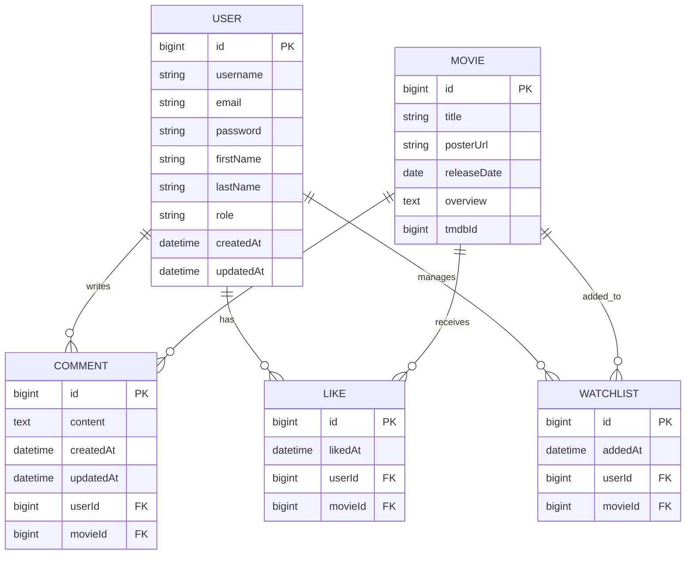

# Cineverse 🎬

A comprehensive RESTful Movie API built with Spring Boot, featuring secure JWT authentication, TMDb integration, and social features. Designed with modern development practices for scalable and maintainable movie platform applications.

## ✨ Features

- JWT Authentication & Authorization
- TMDb API integration for movie data
- CRUD operations for Movies, Comments, Likes, Watchlists
- Search and pagination for improved user experience
- User registration and management
- Social features (likes, comments, watchlists)
- Global exception handling with custom error responses
- Clean architecture with layered design

## 🛠️ Tech Stack

- **Backend:** Spring Boot, Spring Security, Spring Data JPA, Spring WebFlux
- **Database:** MySQL with JPA/Hibernate
- **Security:** JWT tokens, BCrypt password hashing
- **External API:** TMDb integration via WebClient (Spring WebFlux - Reactive HTTP client)
- **Tools:** MapStruct, Lombok, Bean Validation

## Database Schema



## Quick Start

1. **Setup**
```bash
git clone https://github.com/hagagg/cineverse.git
cd cineverse
```

2. **Configuration**

Update `application.properties` with your database connection and TMDb API properties:

```properties
# Database Configuration
spring.datasource.url=jdbc:mysql://localhost:3306/your_database_name
spring.datasource.username=your_username
spring.datasource.password=your_password
spring.datasource.driver-class-name=com.mysql.cj.jdbc.Driver

# JPA Configuration
spring.jpa.hibernate.ddl-auto=none

# TMDb API Configuration
tmdb.api-key=your_tmdb_api_key
tmdb.base-url=https://api.themoviedb.org/3
```

3. **Run**
```bash
mvn spring-boot:run
```

## 🚀 Future Plans

- **Additional Features:** Movie recommendations, user reviews, advanced search filters,etc.
- **Microservices Architecture:** Planning to decompose into microservices for better scalability

## 🤝 Contributing

1. Fork the repository
2. Create a feature branch (`git checkout -b feature/amazing-feature`)
3. Commit your changes (`git commit -m 'Add some amazing feature'`)
4. Push to the branch (`git push origin feature/amazing-feature`)
5. Open a Pull Request

## 👨‍💻 Author

Ahmed Hagag - [@hagagg](https://github.com/hagagg)
